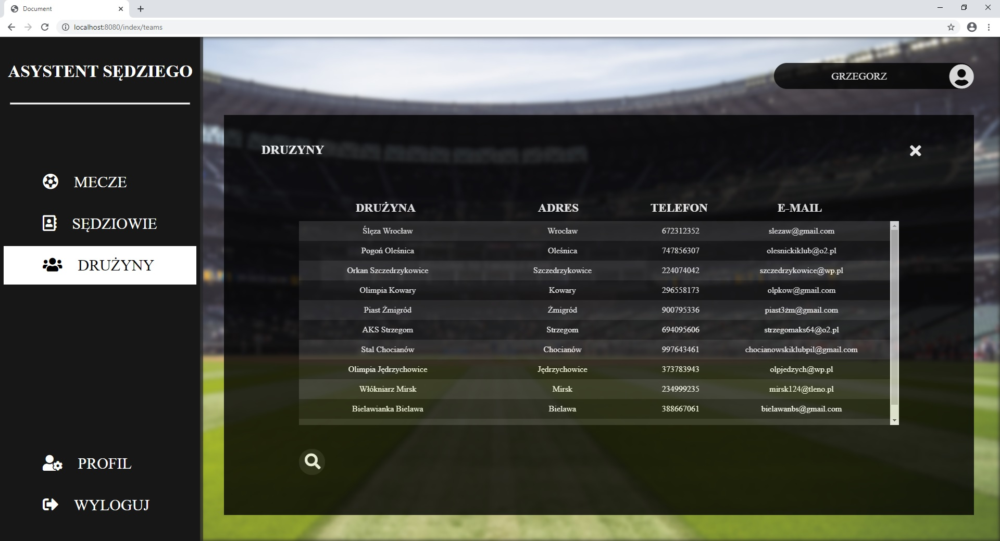
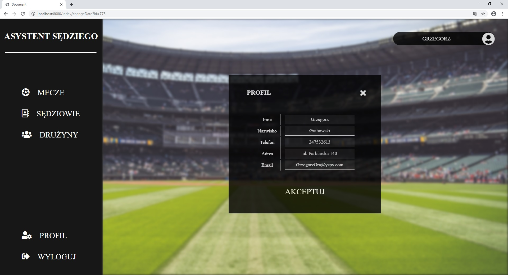

# Asystent Sędziego

## Spis treści
* [Informacje](#informacje)
* [Technologie](#technologie)
* [Funkcje](#funkcje)
* [Zrzuty ekranów](#zrzuty-ekranów)
* [Status](#status)

## Informacje
Projekt Asystent Sędziego jest aplikacja webową. Projekt ma na celu rozwinięcie moich umiejętności w pracy z java, 
frameworkiem Spring i Hibernate oraz w tworzeniu wyglądów stron. Hobbistycznie zajmuję się sędziowaniem meczy piłkarskich, 
co przyczyniło się do powstania aplikacji, która będzie mogła w jednym miejscu zgromadzić dużą liczbę informacji 
przydatnych sędziom piłkarskim w ich pracy.

## Technologie
* Java
* Spring
* H2database
* Hibernate
* Css
* Html
* Thymelaf

## Funkcje
Funkcjonalności:
* Możliwość rejestracji przez nowych użytkowników
* Użytkownik o roli "USER" ma możliwosć dodania meczu, który został przez niego posędziowany.
* Użytkownik o roli "USER" ma możliwosć edytowania dodanego wcześniej przez użtykownika meczu.
* Użytkownik o roli "USER" ma możliwosć usunięcia dodanego wcześniej przez użytkownija meczu.
* Użytkownik o roli "USER" ma dostęp do informacji o swoich meczach, sędziach piłkarskich oraz klubach dodantych do bazy danych.
* Użytkownik o roli "ADMIN" ma dostęp do informacji o meczach, sędziach piłkarskich oraz klubach dodantych do bazy danych.
* Użytkownik o roli "ADMIN" ma możliwość edytowania informacji o meczach, użytkownikach i drużynach dostępnych w bazie danych.
* Użytkownik o roli "ADMIN" ma możliwość usuwania użytkowników, meczy oraz drużyn.

Nad czym pracuje:
* Dodanie funkcji dodawania drużyn przez użytkownika o roli "ADMIN" .
* Stworzenie mockupu dla powyższej funkcji.
* Usprawnienie funkcji edytowania danych użytkowników.
* Usprawnienie funkcji edytowania danych drużyn i meczy.

## Zrzuty ekranów

Ekran logowania.

Ekran rejestracji.

Ekran użytkownika o roli "USER" po zalogowaniu.

Ekran użytkownika w zakładce "mecze".

Ekran użytkownika - dodaj mecz.

Ekran użytkownika, na którym użytkownik widzi wszystkie dodane przes SIEBIE mecze.

Ekran rozszerzonych informacji o danym meczu wybranym przez użytkownika.

Ekran edycji meczu przez użytkownika.

Ekran, na którym uzytkownik może sprawdzić informacje o sędziach dodanych do bazy, w celu np. kontaktu z nimi w sprawie meczu.

Ekran, na którym uzytkownik może sprawdzić informacje o drużynach dodanych do bazy, w celu np. kontaktu z nimi w sprawie meczu.

Ekran, na którym użytkownik widzi swoje dane.

Ekran, na którym użytkownik może edytować swoje dane.

Ekran użytkownika o roli "ADMIN" po zalogowaniu.

Ekran admina, na którym widzi mecze dodane przez wszystkich użytkowników.

Ekran, na którym admin ma możliwość edycji wybranego meczu.

Ekran, na którym admin widzi wszystkich dodanych do systemu użytkowników.

Ekran, na którym admin może edytować dane uzytkowników.

Ekran, na którym admin widzi drużyny piłkarskie dodane do systemu.

Ekran, na którym admin może edytować dane drużyn będących w bazie.

## Status
Projekt jest: _cały czas rozwijany_. Na bieżąco dodaje kolejne funkcje i widoki oraz uaktualniam dotychczas napisany kod.

